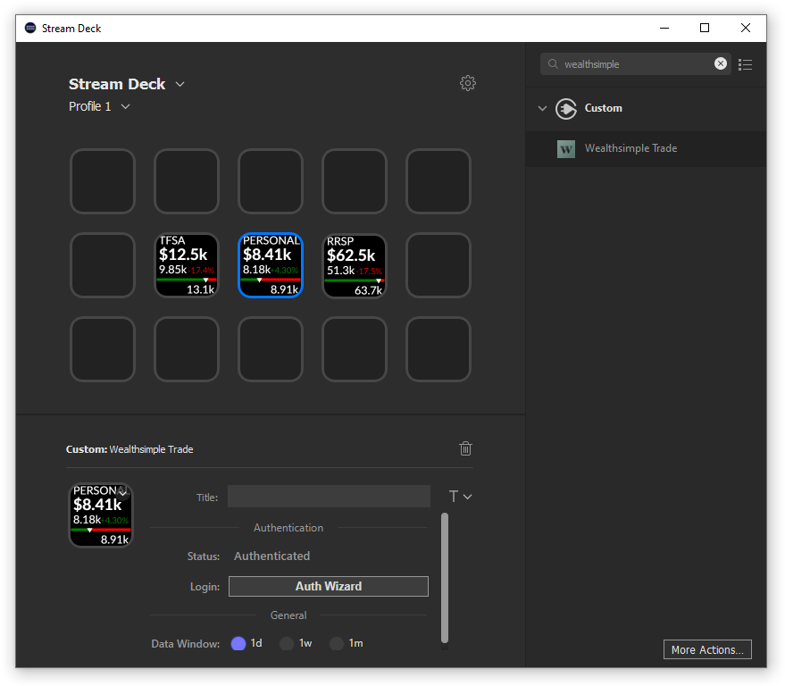
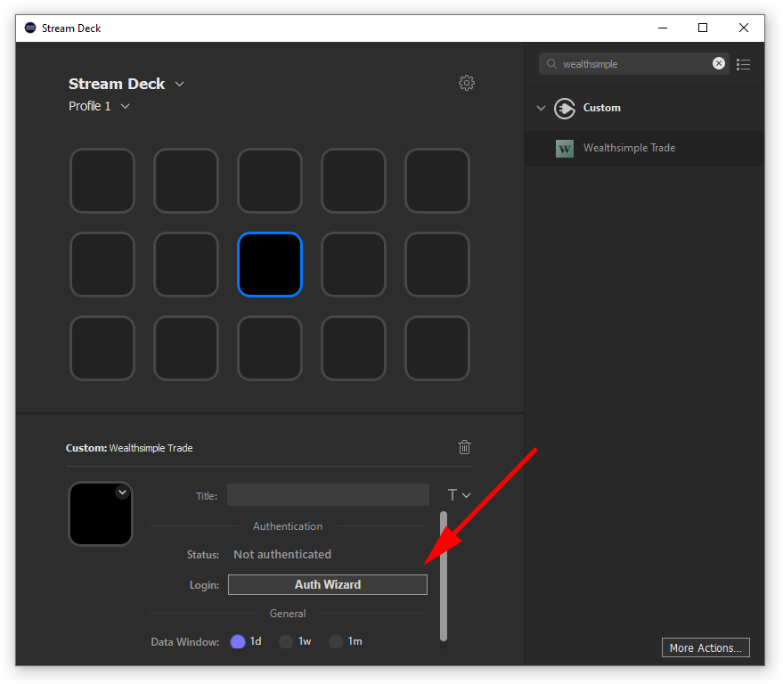
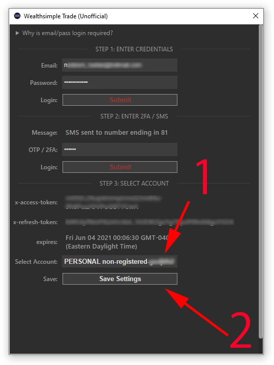
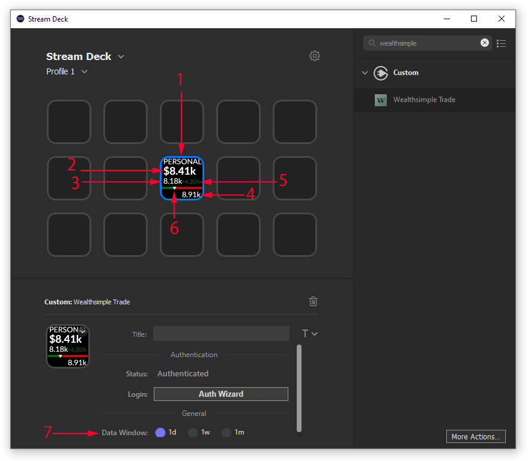

# wstrade-streamdeck
`wstrade-streamdeck` is an unofficial Wealthsimple Trade plugin for the Elgato Stream deck. This plugin makes use of the the [Stream Deck SDK](https://developer.elgato.com/documentation/stream-deck/).

# Features

- Display account value in real-time
- Automatic OAuth token refresh (hourly)
- Daily / Weekly / Monthly high-low tracking
- Buy/Sell securities with a button press (wip!)

# Installation

In the Release folder, you'll find a pre-compiled binary `com.elgato.wstrade.streamDeckPlugin`. Simply run this binary to add the plugin to your StreamDeck plugin list. The "Wealthsimple Trade" action will appear under the "Custom" actions category in the Streak Deck software.

# Manual

1. Account type: `TSFA` or `RRSP` or `CRYPTO` or `PERSONAL`
2. Current account value
3. Lowest account value since start of window
4. Highest account value since start of window
5. % Change since start of window
6. Colored ticker representing the spectrum of values since start of window
7. Data window setting: `1 Day` or `1 Week` or `1 Month`

# Build from source

1. Download the [Elgato StreamDeck DistributionTool](https://developer.elgato.com/documentation/stream-deck/sdk/exporting-your-plugin/) for your platform.
2. Compile from sources `DistributionTool -b -i Sources/com.elgato.wstrade.sdPlugin -o ~/Desktop/`
