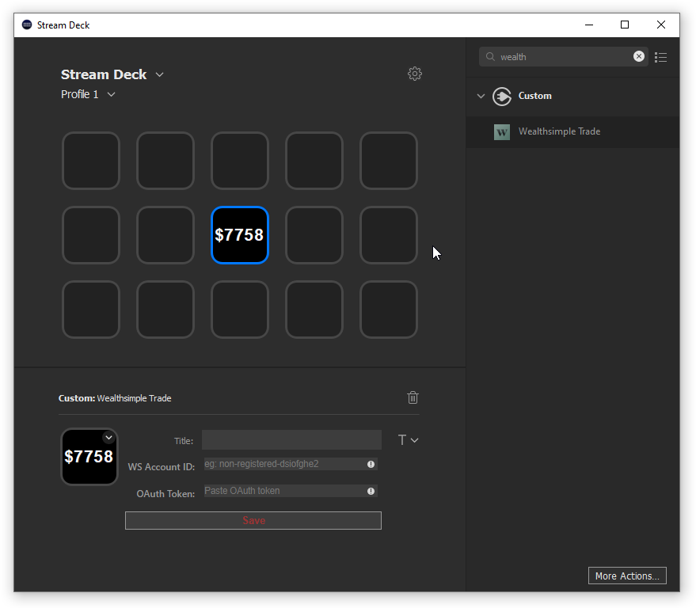

# wstrade-streamdeck
`wstrade-streamdeck` is an unofficial Wealthsimple Trade plugin for the Elgato Stream deck. This plugin makes use of the the [Stream Deck SDK](https://developer.elgato.com/documentation/stream-deck/).

# Features

- Display account value in real-time
- Automatic OAuth token refresh (wip!)
- Daily high-low tracking (wip!)
- Buy/Sell securities with a button press (wip!)

# Installation

In the Release folder, you'll find a pre-compiled binary `com.elgato.wstrade.streamDeckPlugin`. Simply run this binary to add the plugin to your StreamDeck plugin list. The "Wealthsimple Trade" action will appear under the "Custom" category.

# Build from source

1. Download the [Elgato StreamDeck DistributionTool](https://developer.elgato.com/documentation/stream-deck/sdk/exporting-your-plugin/) for your platform.
2. Compile from sources `DistributionTool -b -i Sources/com.elgato.wstrade.sdPlugin -o ~/Desktop/`
